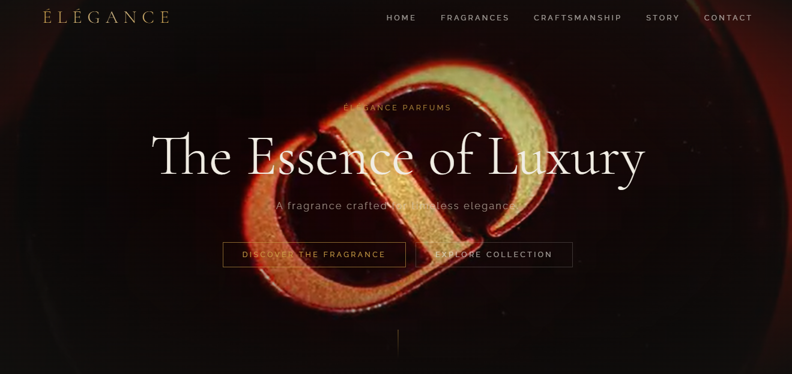
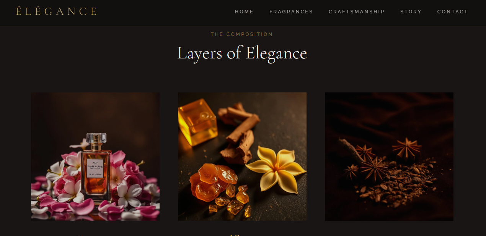

# 🌸 Majestic Elegance — Premium Perfume Website

A modern, elegant, and visually rich perfume website designed to deliver a luxury fragrance shopping experience.
Built with a focus on aesthetics, smooth user interaction, and responsive design.

---

## ✨ Live Demo

🚀 **View Website:**
  https://majestic-elegance-6966.vercel.app/

> ⚠️ Note: Replace this with deployed link (Vercel/Netlify) for public access

---

## 📌 Features

* 🌸 Elegant and luxury-inspired UI design
* 🛍️ Product showcase with detailed sections
* 📱 Fully responsive (mobile + desktop)
* ⚡ Fast loading and smooth animations
* 🎯 Clean layout focused on user experience

---

## 🛠️ Tech Stack

* HTML5
* CSS3
* JavaScript
*  React
* Vite 

---

## 📂 Project Structure

```
Majestic-Elegance/
│── index.html
│── style.css
│── script.js
│── assets/
│── images/
```

---

## 🎯 Objective

The goal of this project is to simulate a **real-world luxury brand website**, focusing on:

* UI/UX design principles
* Clean frontend architecture
* Production-ready deployment

---

## 📸 Screenshots




---

## 🚀 Future Improvements

* 🛒 Add shopping cart functionality
* 💳 Payment integration
* 🔍 Advanced product filtering
* 🌐 Backend integration

---

## 👩‍💻 Author

**Radhika Jayee**
Frontend Developer | Passionate about building aesthetic and functional web apps

---

## ⭐ Show Your Support

If you like this project:

* ⭐ Star this repository
* 🍴 Fork it
* 📢 Share it

---

## 📬 Contact

Feel free to connect for collaboration or opportunities!
gmail : radhikajayee@gmail.com
contact no :9141919859
---
